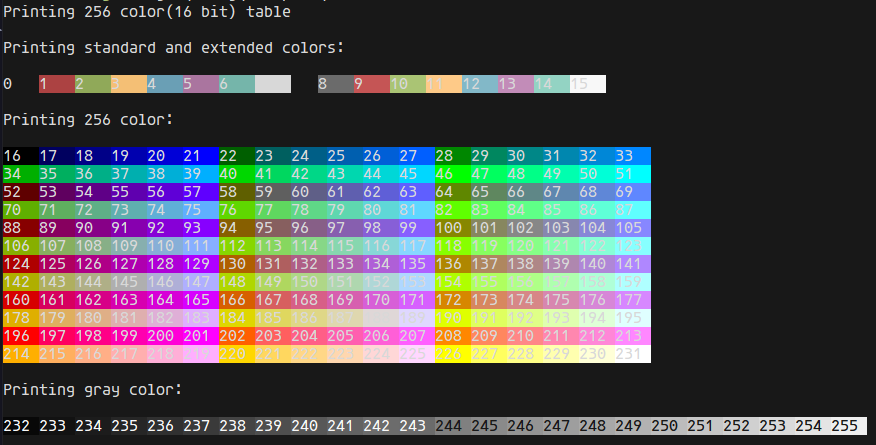

# Ansi Stream
Write blazingly fast, free allocation ansi escape codes to a buffer, and flushes them all to any output stream. Supports 8/16 colors, 256 colors, RGB color rendering output.

## ANSI Escape Codes for Terminal Graphics
The ANSI escape code standard, formally adopted as ISO/IEC 6429, defines a series of control sequences.
Each control sequence begins with a **Control Sequence Introducer** (CSI), defined as a scape character
followed immediately by a bracket: **ESC[**. In particular, a CSI followed by a certain number of "parameter bytes"
(ASCII 0-9:; <=>?) then the letter m forms a control sequence known as **Select Graphic Rendition** (SGR). If no
parameter bytes are explicitly given, then it is assumed to be 0. SGR parameters can be chained together with a semicolon **;**
as **delimiter**.

Some common SGR parameters are shown below.

|Parameter | Effect|
|- | -|
|0 | reset all SGR effects to their default|
|1 | bold or increased intensity|
|2 | faint or decreased insensity|
|4 | singly underlined|
|5 | slow blink|
|30-37 | foreground color (3/4 bit)|
|38;5;x | foreground color (256 colors, non-standard)|
|38;2;r;g;b | foreground color (RGB, non-standard)|
|40-47 | background color (8 colors)|
|48;5;x | background color (256 colors, non-standard)|
|48;2;r;g;b | background color (RGB, non-standard)|
|90-97 | bright foreground color (non-standard)|
|100-107 | bright background color (non-standard)|


* Below example will print a red underlined text.


## Usage

* Add the **AnsiStream** crate to your Cargo.toml

```
$ cargo add ansistream
```

## Examples

* 256color example



## References